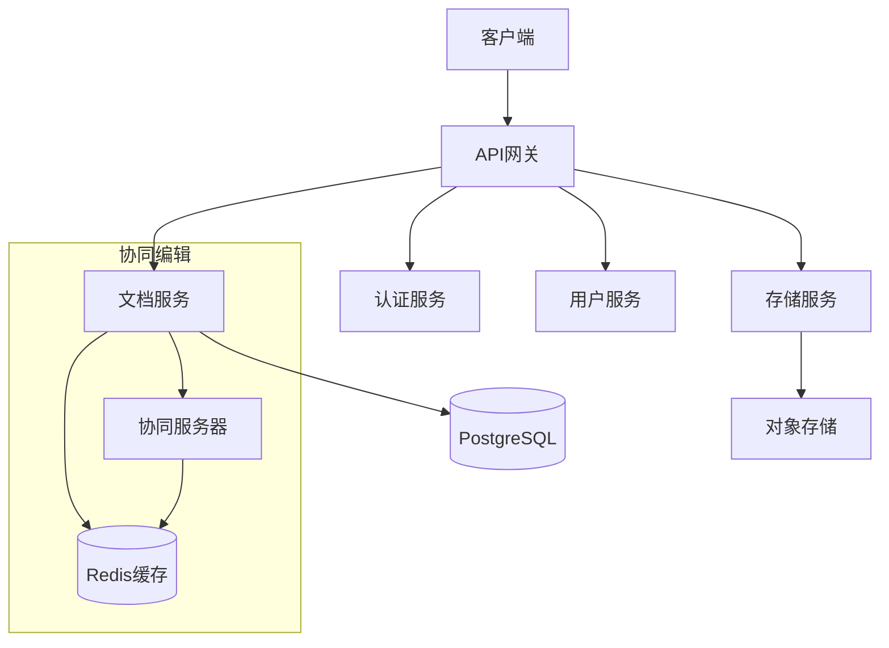
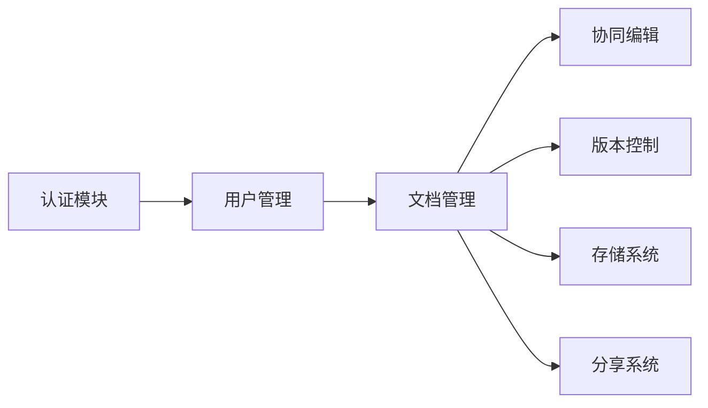
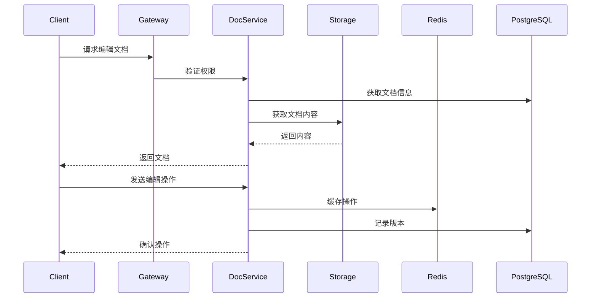
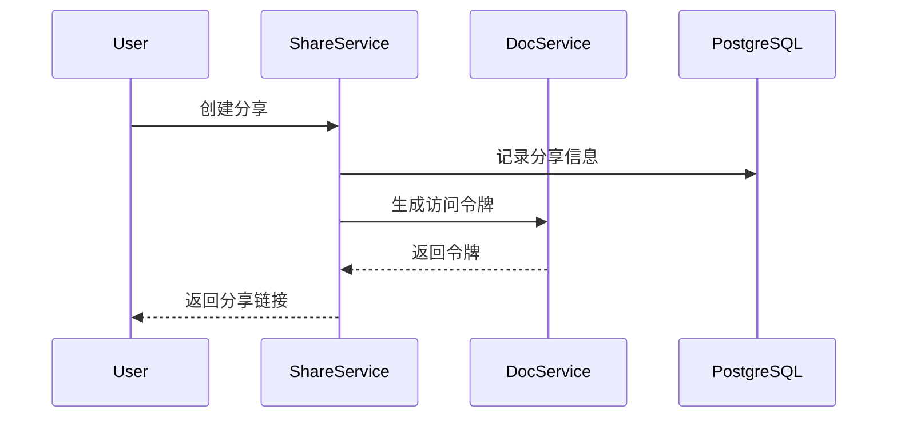
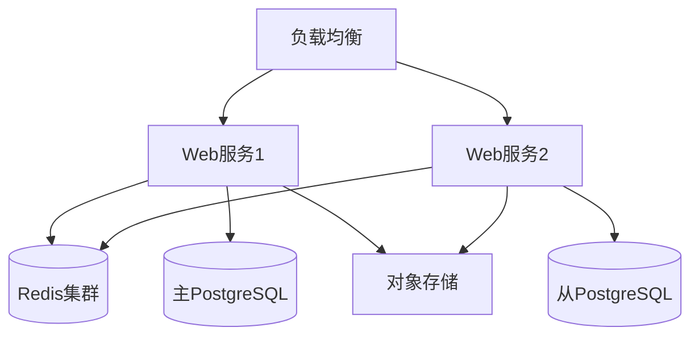

# WebSheet 系统架构设计文档

## 1. 系统概述

### 1.1 项目信息
- 系统名称：WebSheet
- 开源协议：MIT
- 核心组件：Vue-Office
- 数据库：PostgreSQL

### 1.2 系统目标
WebSheet是一个企业级在线文档协同编辑系统，旨在提供安全、高效、易用的文档管理和协作平台。系统支持多种文档格式的在线预览和编辑，并具备完善的权限管理和版本控制功能。

## 2. 系统架构

### 2.1 整体架构


### 2.2 技术栈选择

#### 前端技术栈
- 核心框架：Vue 3 + TypeScript
- 状态管理：Pinia
- UI组件库：Element Plus
- 文档编辑：Vue-Office
- WebSocket：Socket.IO Client
- 构建工具：Vite
- 包管理器：pnpm

#### 后端技术栈
- 运行时：Node.js
- Web框架：NestJS
- 数据库：PostgreSQL
- 缓存：Redis
- 对象存储：S3兼容存储
- 消息队列：Redis Pub/Sub
- API网关：Kong
- 容器化：Docker + Docker Compose

### 2.3 系统模块划分



## 3. 核心功能模块设计

### 3.1 用户管理模块
- 管理员用户管理
- 权限管理（RBAC）
- 部门组织管理
- 登录认证与会话管理

### 3.2 文档管理模块
- 文档元数据管理
- 文档分类与标签
- 文档检索
- 版本控制
- 回收站功能

### 3.3 协同编辑模块
- 基于OT算法的实时协同
- 冲突解决
- 操作历史记录
- 在线状态同步

### 3.4 存储模块
- 分片上传
- 断点续传
- 文件预览
- 存储策略管理

### 3.5 分享模块
- 外链分享
- 权限控制
- 访问统计
- 链接有效期管理

## 4. 数据流转设计

### 4.1 文档编辑流程


### 4.2 文档分享流程


## 5. API设计规范

### 5.1 RESTful API设计
- 使用标准HTTP方法
- 采用资源导向的URL设计
- 统一的错误处理
- 版本控制

### 5.2 WebSocket API设计
- 基于Socket.IO
- 事件驱动
- 心跳检测
- 重连机制

### 5.3 主要API端点
```
/api/v1/auth     # 认证相关
/api/v1/users    # 用户管理
/api/v1/docs     # 文档管理
/api/v1/share    # 分享管理
/api/v1/storage  # 存储管理
```

## 6. 安全设计

### 6.1 认证与授权
- JWT token认证
- RBAC权限控制
- API访问控制
- 操作审计日志

### 6.2 数据安全
- 传输加密（HTTPS）
- 存储加密
- 敏感信息脱敏
- 数据备份策略

## 7. 性能优化

### 7.1 缓存策略
- Redis缓存层
- 浏览器缓存
- CDN加速

### 7.2 性能优化措施
- 文档分片加载
- 延迟加载
- 请求合并
- 数据压缩

## 8. 部署架构

### 8.1 开发环境
- 本地开发环境
- 测试环境
- 预发布环境
- 生产环境

### 8.2 容器化部署


## 9. 监控告警

### 9.1 监控指标
- 系统性能指标
- 业务指标
- 安全指标
- 用户体验指标

### 9.2 告警策略
- 错误告警
- 性能告警
- 安全告警
- 业务告警

## 10. 扩展性设计

### 10.1 水平扩展
- 服务无状态化
- 数据库读写分离
- 缓存集群
- 负载均衡

### 10.2 垂直扩展
- 模块化设计
- 插件化架构
- 服务解耦
- 异步处理